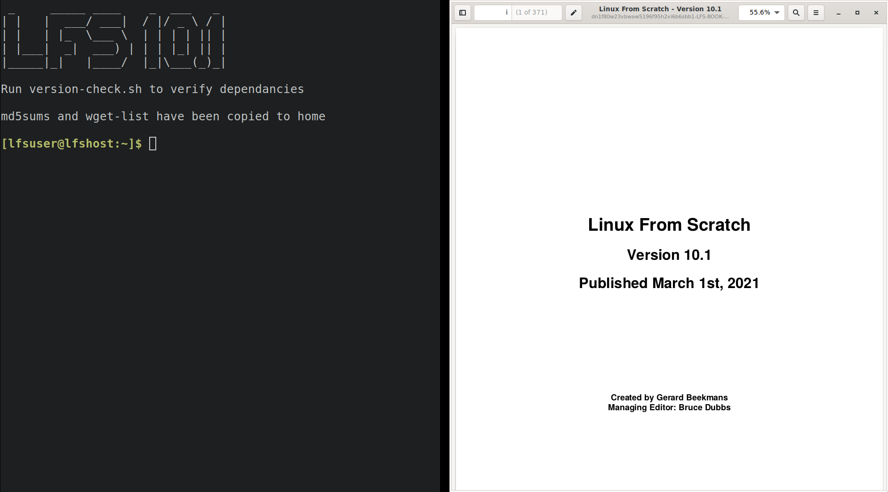

# Linux From Scratch Installer
This is an environment that I created from myself to install Linux from scratch from.

Feel free to use it or modify it for your needs.



I have only tested this on Libvirt/Qemu and it appears to work ok.

The system will boot to an i3wm environment with the LFS manual 
and a terminal.

## Requirements
 - Nix (with flakes support)

## Build instructions
To build simply run the following from the git repositoriy directory:

```shell
nix build
```
